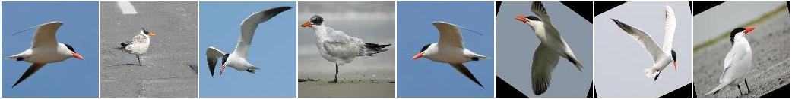
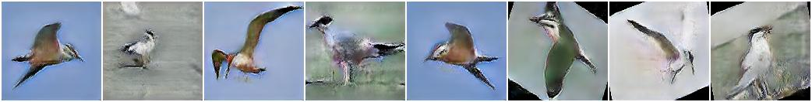
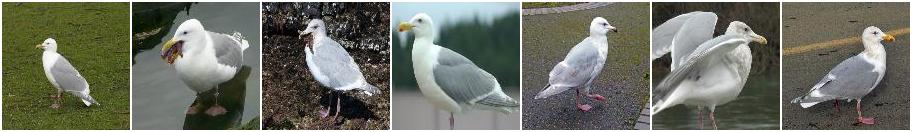
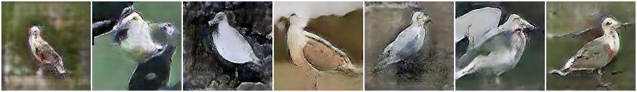
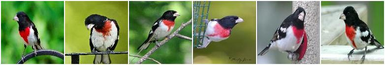
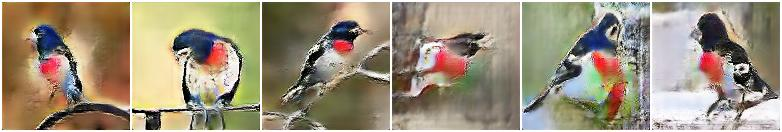

# M-GAN
Can be called as a Manipulative-GAN

A GAN that tries to accommodate changes in images using textual data.
GAN (Generative Adversarial Network) is a neural network that can generate data from some noise or some valid inputs.
Using this ability of GAN and after going through some resources I tried to implement a GAN that can manipulate an image using relevant pieces of text.

### Packages required:
- Numpy
- Pandas
- OpenCV
- Pytorch
- NLTK
- Genism
- FastText

The model was trained using the famous CUB-200 dataset that was made by the Caltech Institute of Technology and UCSD as a joint project. It has 200 species of birds.
There are captions/information regarding each image that describes the image. Using that information an architecture that uses a DCGAN along with a text encoder so it can be used to manipulate the data.

### Files
- Image Augmentation.ipynb - It is just for some ways in which images where augmented
- Making train-data.ipynb - It consists of code that uses Facebook's FastText embeddings to generate word embeddings for creation of word vectors.
- train.ipynb - It consists of the notebook that is used to train the model and describe all the losses and the entire training module.
- test.ipynb - It consists of taking the data and using that to test our trained model saved in the models directory. (The file 'birds_GEN.pth' is the generator file that can be used in this notebook.
- data_vector.py - It contains a class that is then used by the dataloader of the pytorch lib to use the dataset during training.
- model.py - This is the main file containing the networks for the Generator and Discriminator modules along with the text-encoder.

Some other files including the final.csv and new_dict_data are the data sources that were generated for making the training process easier.

### Some Results that were recorded by using the trained weights:
1.) Text Input: A bird with blue body and black beak.

Original Image

Generated Image

2.) Text Input: Bird having black feathers.

Original Image

Generated Image

3.) Text Input: A bird having a light blue color and pink neck.

Original Image

Generated Image

#### You have to see the results very minutely to spot the differences that were manipulated using the text input provided.
#### Still the colours are image quality is not upto the mark but and I am working upon the model and will improve it soon and push the changes. Any suggestions and feedbacks are welcome. Thank you.  
